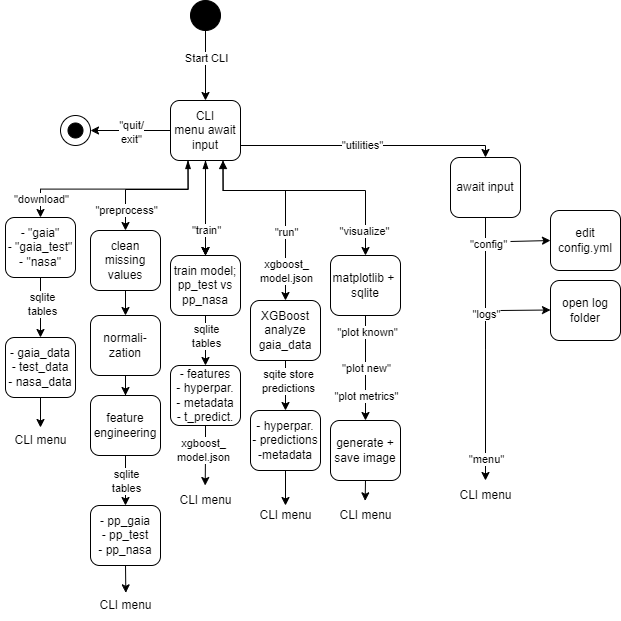

# CS-499 Capstone Project
Final Project for SNHU CS-499
Aiden Villanueva
July 20, 2026

Version:

1.1.0     |     Added User Guide, Developer Guide,       
          |         Installation and Configuration sections
          |     Added Testing and Model Management descriptions

1.0.0     |     Added basic description and module breakdown


# Project GaiaML
Project GaiaML is an open-source scientific data tool designed to use eXtreme Gradient Boosted (XGBoost) trees in order to classify Gaia DR3 data against NASA's Exoplanet Archive of known and suspected exoplanet host stars. 

The goal is to show that XGBoost is a strong choice for analyzing large, tabularized data sets such as many astronomical data, and that it is capable of being tuned and trained to accurately classify known systems as well as to create predictions for possible new candidates. 

# Project Structure

The project is organized around data preparation, model training, evaluation, and prediction. Key folders and files are arranged to separate data ingestion, feature engineering, training pipelines, and results.

- config/: YAML file(s) for globalizing variables and model configuration parameters.
- data/: raw data files, cleaned datasets, and lookup tables.
- src/: core project code including data processing, feature engineering, and model utilities.
- docs/: supplementary documentation, notes, and reference material.

# Main Files

- `main.py`: entry point for running the training and prediction workflow.
- `gaia_ & nasa_downloader.py`: handles loading Gaia DR3 data and NASA Exoplanet Archive data, including parsing and validation.
- `preprocessor.py`: creates derived features, handles missing values, and prepares data for XGBoost.
- `xgboost_trainer.py`: trains the XGBoost classifier and saves the trained model.
- `model_evaluator.py`: evaluates model performance on test data and generates metrics.
- `model.py`: runs the trained model on new Gaia DR3 data for candidate classification.

Deprecated artifacts such as `TreasureHuntGame`, `TreasureMaze.py`, and `GameExperience.py` are intentionally excluded from the final project structure and documentation.

# CLI Flowchart
The core of GaiaML is a command-line interface which uses a menu as a state machine 
to match user input strings to functional modules. 




# Installation
Prerequisites:
- Python 3.8 or higher
- pip (Python package manager)

Required packages:
- xgboost
- pandas
- numpy
- scikit-learn
- pyyaml
- requests

To install dependencies:
```bash
pip install -r requirements.txt
```

# User Guide

Run `main.py` to launch the program:
```bash
python main.py
```

The CLI guides you through the following options:
1. Download and prepare data
2. Train the XGBoost model
3. Evaluate model performance
4. Predict on new Gaia DR3 candidates

Follow the on-screen prompts to select your desired workflow.

# Developer Guide

## Code Organization

All source code is located in the `src/` directory. Each module handles a specific phase of the data pipeline:

- **Data Ingestion**: `gaia_` & `_nasa_downloader.py` manages API calls and file I/O
- **Feature Engineering**: `preprocessor.py` implements scaling, normalization, and feature derivation
- **Model Training**: `xgboost_trainer.py` handles hyperparameter tuning and model serialization
- **Evaluation**: `model_evaluator.py` generates metrics and validation reports
- **Inference**: `model.py` applies trained models to new data

## Configuration

All configurable parameters should be defined in `config/config.yaml`. This includes:
- Data source URLs and API endpoints
- Feature lists and engineering parameters
- XGBoost hyperparameters
- Train/test split ratios
- Output paths and logging levels

## Testing

Unit tests are located in the `tests/` directory and follow the naming convention `test_*.py`. To run tests:

```bash
python -m pytest tests/ -v
```

OR 

Use "test" from the main menu of the CLI.

Add tests for:
- Data validation and cleaning logic
- Feature engineering transformations
- Model training and prediction workflows
- Configuration loading and validation

## Model Management

Trained models are saved to `models/` with timestamps. Keep `models/latest_model.pkl` as a symlink to the most recent model for easy reference.

Document model versions in `models/model_registry.json` with metadata:
- Training date
- Training data size
- Performance metrics
- Feature set version
